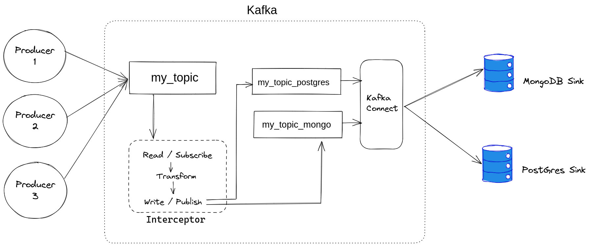

## How to Use
1. Install docker and docker compose. Clone this git repo, and `cd` into it using a terminal.
2. Run `docker-compose up --build` (you can check the running containers by using `docker ps`). You may run `docker-compose down` to stop the containers if you want to
3. Then, open a web browser and go to `http://172.30.0.99:3000/docs` to access the Swagger documentation. Click `Try it out` and send the data. You will receive a message stating 
<mark>Message sent successfully.</mark>

4. You can check that your message is stored in both the `PostgreSQL` and `MongoDB` databases:
  4.1. Open the <mark>MongoDB</mark> connection string: `mongodb://172.30.0.102:27017/`
(you can see a database named "testdb" and a collection named "foo" automatically there).
  4.2. Open <mark>PostgreSQL</mark> using the following details:

    `Host: 172.30.0.103`

    `Database: kafka1`

    `Username: postgres`

    `Password: postgres`

## Architecture Diagram

